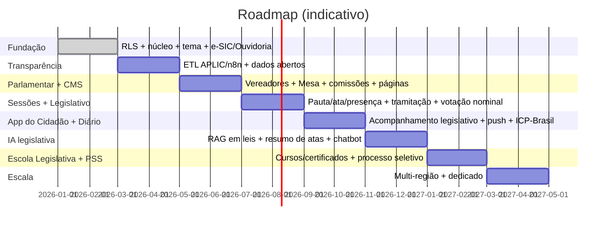

# 11 — Roadmap

Fases em ordem de dependência. Cada fase tem critério de saída objetivo. A base transversal (RLS, tema, e-SIC/Ouvidoria, Transparência, IA, CMS, App) vem do fork da plataforma de prefeitura; o roadmap específico da Câmara concentra-se nos **módulos legislativos**.

## Fase 0 — Fundação ✅ (scaffold entregue)
Multi-tenancy + RLS, núcleo NestJS (tenant/RBAC), motor de temas + WCAG, e-SIC/Ouvidoria (FSM + SLA + worker), Docker.
**Saída:** isolamento RLS testado; manifestação registra, transita e dispara SLA; tema bloqueia WCAG.

## Fase 1 — Transparência
ETL via n8n a partir do sistema contábil/APLIC-TCE; modelo canônico `transp_*`; portal ISR; API de dados abertos (CSV/JSON) + dicionário. Foco na execução orçamentária **da própria Câmara**.
**Saída:** despesas da Câmara publicadas com defasagem ≤ 24h (LC 131); exportação e API funcionando; idempotência do ETL provada.

## Fase 2 — Parlamentar + CMS
Vereadores (mandato, partido, posts), **Mesa Diretora** com vigência, **comissões** e representações; CMS de páginas/blocos; gestão de identidade visual no admin.
**Saída:** a Câmara monta home e páginas sem deploy; composição da Mesa e das comissões publicada com vigência.

## Fase 3 — Sessões Plenárias + Legislativo
Pauta, ata, **presença/frequência**, calendário e TV Câmara; **proposições** com **tramitação** (FSM) e **votação nominal**; repositório de leis/normas; iniciativa popular.
**Saída:** sessão registrada com pauta/ata/presença; proposição tramita ponta a ponta; votação nominal pública e auditável; lei publicada e pesquisável.

## Fase 4 — App do Cidadão + Diário Oficial
Expo: acompanhamento da atividade legislativa (proposições, sessões, leis), agenda, push, login gov.br, manifestações por protocolo. Diário Oficial da Câmara com assinatura **ICP-Brasil** + carimbo de tempo; busca e arquivo.
**Saída:** app publicado nas lojas com acompanhamento legislativo; edição do Diário assinada e verificável; integridade comprovável.

## Fase 5 — IA legislativa
**RAG em leis/normas e proposições**, **resumo de atas**, triagem/classificação de manifestações (com revisão humana), chatbot da Câmara, OCR de documentos.
**Saída:** busca semântica respondendo da base oficial de leis/proposições; resumo de ata gerado e revisável; triagem sugerindo roteamento com acurácia medida; DPIA aprovado.

## Fase 6 — Escola Legislativa + PSS
Escola Legislativa (cursos, provas, **certificados com QR + validação pública**, fórum); PSS (editais, vagas, fases, inscrição, ranking, integração APLIC); Eventos/audiências públicas com inscrição e certificação.
**Saída:** certificado emitido com QR validável publicamente; processo seletivo do edital à classificação ponta a ponta.

## Fase 7 — Escala / Multi-região
Réplicas de leitura, schema dedicado para câmaras de grande porte, multi-região, residência de dados.
**Saída:** SLA de disponibilidade atingido sob carga de teste; promoção de tenant a schema dedicado sem downtime.

## Transversal (todas as fases)
Segurança/DevSecOps no CI, conformidade LGPD por feature, acessibilidade, observabilidade e documentação sempre atualizadas. Conformidade PNTP/Atricon pela dimensão **Atividades Finalísticas (Legislativo)** acompanha as Fases 2–3.
